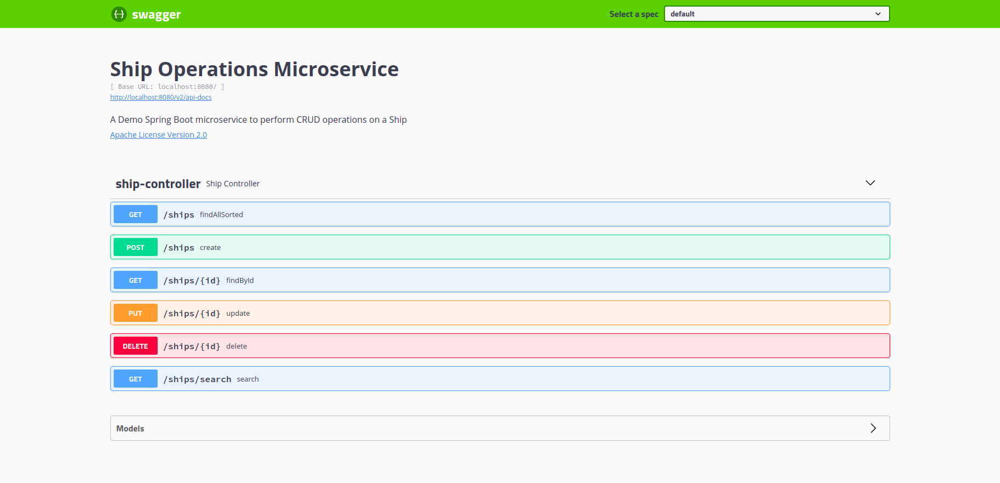

# Ship Operations Server
A Spring Boot Sample Project to perform CRUD (Create, Read, Update and Delete) operations on a ship. 

The client code is available in this [link](https://github.com/bhaskargogs/ship-operations-client).

# Tools used

The following main tools are used:
* Spring Boot
* Junit and Mockito 
* Cucumber 
* H2 Database 

# Setup and Build

Clone the repository to your workspace

```shell
git clone https://github.com/bhaskargogs/ship-operations-server
cd ship-operations-server
mvn clean install
```

# Deployment

To start the application, simply run the following command:
```shell
mvn spring-boot:run
```

The server runs at [http://localhost:8080](http://localhost:8080)

# H2 Database

H2 database runs at [http://localhost:8080/h2-console](http://localhost:8080/h2-console)
```shell
JDBC URL: jdbc:h2:mem:shipdb
username: admin
password: admin
```

# Swagger

Swagger runs at [http://localhost:8080/swagger-ui.html](http://localhost:8080/swagger-ui.html)



# Testing and Reporting

Unit tests are done using JUNit and Mockito, while Cucumber is used for integration testing 
and it generates a nice report.

Note: Please don't stop the deployment

Run the following command to do testing and generate cucumber reports **(in another terminal/command prompt window)**:
```shell
mvn test verify
```

To look for the report simply go to `reports/html-reports/cucumber-html-reports` folder

`overview-features` shows you the following graph.


# License
This project is licensed under the Apache 2.0 License - see the [LICENSE](LICENSE) file for details.
